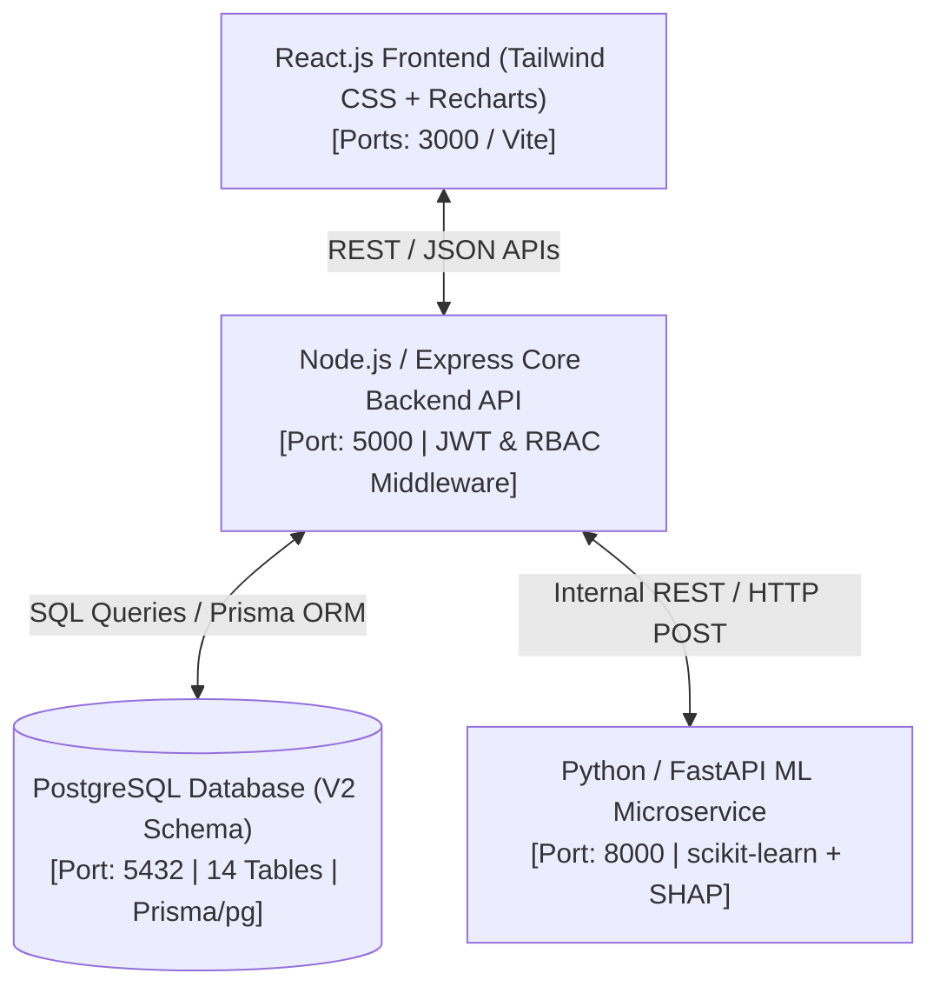

# UNIFIED EDUCATION INTERFACE (UEI) — COMPLETE MASTER SPECIFICATION
**Project ID:** SKIT/CS/2023-2027/27 (CS-27) | **Section:** B | **Department:** Computer Science & Engineering  
**SDG Alignment:** SDG 4 — Quality Education | **Dual Framing:** College Final-Year Project & SIH Submission (Problem Statement CSE-201)  
**Authors/Team Roster:**  
- **Harsh Khandelwal (23ESKCS085):** Team Lead, Full Stack & System Architecture (Core Backend Lead)  
- **Janvi Gupta (23ESKCS103):** Frontend UI/UX Lead  
- **Kashish Soni (23ESKCS114):** Database Admin & QA Engineer  
- **Katyayini Sharma (23ESKCS115):** AI/ML & Data Science Lead  
**Mentors:** Dr. Sunil Dhankhar (Supervisor, Associate Professor), Dr. Jyoti Singh (Lab Coordinator)  

---

## 1. EXECUTIVE SUMMARY & PROJECT IDENTITY

The **Unified Education Interface (UEI)** is a CSE-department-level centralized educational data integration, analytics, and early-warning platform. It is designed to solve the critical problem of fragmented educational data across disconnected departmental silos (academic records, attendance, semester grades, coding skills, certifications, internships, placement history, and faculty assignments).

UEI establishes a **Single Source of Truth** by linking all student, faculty, and institutional data under a unified relational data model powered by **Canonical Identifiers**:
- **APAAR ID (Automated Permanent Academic Account Registry):** Canonical key for students.
- **AISHE Code (All India Survey on Higher Education):** Canonical institution key.
- **Employee ID:** Canonical faculty key.

On top of this unified data layer, UEI deploys an **Intelligence Layer** composed of:
1. **Dynamic Student Lifecycle Digital Twin:** Mapping student trajectory from admission through 8 semesters to placement.
2. **Explainable AI Early-Warning System:** Machine Learning risk classification (`LOW`, `MEDIUM`, `HIGH`) with **mandatory SHAP-based feature attribution** (explaining *why* a student is flagged).
3. **Holistic Placement Readiness:** Multi-dimensional scoring combining CGPA, technical skills, aptitude, and coding profiles.
4. **Grading Pattern Insights:** Descriptive, non-judgmental analysis of subject grade distributions and internal vs. external marks correlations.
5. **DPDP Act 2023 Compliance:** Consent and immutable audit logging for student data privacy.

---

## 2. PROBLEM STATEMENT & IMPACT ANALYSIS

### 2.1 The Core Problem
Educational institutions maintain student records across disconnected units:
- Academic marks in examination spreadsheets.
- Attendance in daily registers or separate portal modules.
- Skills, certifications, and GitHub/LeetCode profiles on student resumes.
- Internship and placement outcomes in training and placement cell files.
- Faculty subject allocations in departmental load charts.

This lack of a shared canonical identifier and analytics layer creates **data fragmentation**.

### 2.2 Systemic Impact
- **Delayed Academic Interventions:** At-risk students remain unnoticed until semester grades drop or backlogs accumulate.
- **Incomplete Student Evaluation:** Faculty and mentors evaluate students purely on CGPA without visibility into skills or practical readiness.
- **High Administrative Friction:** HODs and administrators spend hundreds of hours manually compiling reports for accreditation or batch tracking.
- **Information Asymmetry:** Students lack a single dashboard to track their complete academic and skill growth over 4 years.

### 2.3 UEI Solution Thesis
`Fragmented Data → Ingestion & Normalization → Canonical Identity (APAAR) → PostgreSQL Single Source of Truth → REST API Layer → Role-Specific Dashboards (React) + Machine Learning Predictions (FastAPI + SHAP) → Timely Actionable Intervention`

---

## 3. CORE INNOVATIONS & KEY DIFFERENTIATORS (USPs)

1. **Canonical Data Integration (APAAR & AISHE):** Connects isolated tables under standardized Indian national identity keys without raw Aadhaar storage.
2. **Dynamic Student Lifecycle Digital Twin:** Represents a student's entire 4-year journey (admission, 8 semesters of SGPA/CGPA, credits, attendance trends, verified skills, certifications, internships, and placement status).
3. **Explainable Early-Warning System (SHAP Mandatory Rule):** ML model never outputs a bare risk probability. Every prediction is accompanied by top 3 contributing factors (e.g., `"Low mid-term score in Data Structures (-0.42)"`, `"Attendance drop in Semester 4 (-0.31)"`).
4. **3-Class Risk Categorization:** Simplifies actionability into `LOW`, `MEDIUM`, and `HIGH` risk levels.
5. **Holistic Placement Readiness Score:** Combines academic performance (CGPA), technical skill proficiency, aptitude scores, and coding profile metrics into a 0–100 readiness index.
6. **Descriptive Grading Pattern Insights:** Reframed from workload matrices to show subject-level grade distributions, internal vs. final exam score correlations, and backlog concentrations without ranking or comparing faculty against each other.
7. **DPDP Act 2023 Compliance & Audit Trail:** Immutable `audit_logs` tracking every access, data export, and role-based action across the system.

---

## 4. END-TO-END SYSTEM ARCHITECTURE & TECH STACK

### 4.1 System Topology
UEI uses a decoupled, 3-tier micro-services architecture:



### 4.2 Technology Stack
- **Frontend:** React.js (v18+), Tailwind CSS, Lucide Icons, Recharts (Data Visualization), Vite.
- **Core Backend:** Node.js (v18+), Express.js, JWT (`jsonwebtoken`), CORS, `dotenv`, Prisma ORM / `pg`.
- **Database:** PostgreSQL (v15+) with 14 normalized tables, 8 custom ENUMs, and B-tree indexes.
- **AI/ML Service:** Python 3.10+, FastAPI, `scikit-learn`, `pandas`, `numpy`, `shap` (TreeExplainer / KernelExplainer).
- **DevOps & Environment:** Docker, Docker Compose, GitHub Actions (CI/CD workflows), Minimum Hardware: 8GB RAM, CPU (No GPU required).

---

## 5. DATABASE SCHEMA SPECIFICATION (POSTGRESQL V2)

The V2 schema (`H:\schema_v2.sql`) consists of **14 tables** and **8 custom ENUM types**, establishing complete data integrity across all 21 dashboard pages.

### 5.1 Custom ENUM Types
1. `user_role`: `'STUDENT'`, `'FACULTY'`, `'HOD'`, `'ADMIN'`
2. `course_type`: `'THEORY'`, `'LAB'`
3. `attendance_status`: `'PRESENT'`, `'ABSENT'`, `'EXCUSED'`
4. `internship_status`: `'ONGOING'`, `'COMPLETED'`
5. `achievement_category`: `'HACKATHON'`, `'PUBLICATION'`, `'CONTEST'`, `'CERTIFICATION'`, `'SPORTS'`, `'CLUB'`
6. `risk_level`: `'LOW'`, `'MEDIUM'`, `'HIGH'` *(3-class model)*
7. `skill_proficiency`: `'BEGINNER'`, `'INTERMEDIATE'`, `'ADVANCED'`, `'EXPERT'`
8. `placement_outcome`: `'NOT_PLACED'`, `'IN_PROCESS'`, `'PLACED'`

---

### 5.2 Full 14-Table Definitions

```
                     +-------------------+
                     |       USERS       |
                     +-------------------+
                               | 1:1
                               +-----------------------+
                               |                       |
                     +-------------------+   +-------------------+
                     | STUDENT_PROFILES  |   | FACULTY_PROFILES  |
                     +-------------------+   +-------------------+
                       | 1:1   | 1:N  | 1:N    | 1:N          | 1:N
     +-----------------+       |      +----+   |              |
     |                         |           |   v              v
+---------------------+        |      +------------------+ +-----------------------------+
| PLACEMENT_READINESS |        |      | STUDENT_SKILLS   | | FACULTY_COURSE_ASSIGNMENTS  |
+---------------------+        |      +------------------+ +-----------------------------+
                               |      | INTERNSHIPS      |
                               |      +------------------+
                               |      | ACHIEVEMENTS     |
                               |      +------------------+
                               |      | SEMESTER_RECORDS |
                               |      +------------------+
                               v
                     +--------------------+
                     | COURSE_ENROLLMENTS |<------+
                     +--------------------+       | 1:N
                       | 1:N                      |
                       v                    +--------------------+
                     +--------------------+ |      COURSES       |
                     | ATTENDANCE_RECORDS | +--------------------+
                     +--------------------+       | 1:N
                       ^                          |
                       | 1:N                      v
                     +-----------------------------------+
                     |        WEAK_STUDENT_RADAR         |
                     +-----------------------------------+
```

#### 1. `users` (Core Auth)
- `id` (UUID, PK, `gen_random_uuid()`)
- `email` (VARCHAR(255), UNIQUE, NOT NULL)
- `password_hash` (VARCHAR(255), NOT NULL)
- `role` (ENUM `user_role`, DEFAULT `'STUDENT'`)
- `is_active` (BOOLEAN, DEFAULT `TRUE`)
- `created_at`, `updated_at` (TIMESTAMP)

#### 2. `student_profiles` (Canonical Digital Twin Anchor)
- `id` (UUID, PK)
- `user_id` (UUID, UNIQUE, FK -> `users.id` ON DELETE CASCADE)
- `roll_number` (VARCHAR(50), UNIQUE, NOT NULL)
- `registration_no` (VARCHAR(50), UNIQUE, NOT NULL)
- `name` (VARCHAR(255), NOT NULL)
- `branch` (VARCHAR(100), DEFAULT `'Computer Science & Engineering'`)
- `section` (VARCHAR(10), NOT NULL)
- `batch_year` (VARCHAR(20), NOT NULL) — e.g. `'2023-2027'`
- `admission_date` (DATE)
- `age` (INT)
- `scholarship_status` (BOOLEAN, DEFAULT `FALSE`)
- `phone` (VARCHAR(20))
- `aadhar_no` (VARCHAR(20), UNIQUE) — *Plain string per team decision*
- `apar_id` (VARCHAR(50), UNIQUE) — *Canonical Student Key*
- `aishe_id` (VARCHAR(50)) — *Canonical Institution Key*
- `current_semester` (INT, DEFAULT 1)
- `current_cgpa` (FLOAT, DEFAULT 0.0)
- `total_credits` (INT, DEFAULT 0)
- `overall_attendance` (FLOAT, DEFAULT 100.0)
- `github_url`, `leetcode_url`, `linkedin_url`, `resume_url`, `avatar_url` (TEXT)
- `created_at`, `updated_at` (TIMESTAMP)

#### 3. `faculty_profiles`
- `id` (UUID, PK)
- `user_id` (UUID, UNIQUE, FK -> `users.id` ON DELETE CASCADE)
- `employee_id` (VARCHAR(50), UNIQUE, NOT NULL)
- `name` (VARCHAR(255), NOT NULL)
- `department` (VARCHAR(100), DEFAULT `'Computer Science & Engineering'`)
- `designation` (VARCHAR(100), NOT NULL)
- `specialization` (VARCHAR(100))
- `phone` (VARCHAR(20))
- `created_at`, `updated_at` (TIMESTAMP)

#### 4. `courses`
- `id` (UUID, PK)
- `code` (VARCHAR(20), UNIQUE, NOT NULL) — e.g. `'CS-501'`
- `title` (VARCHAR(255), NOT NULL)
- `semester` (INT, NOT NULL)
- `credits` (INT, NOT NULL)
- `type` (ENUM `course_type`, DEFAULT `'THEORY'`)
- `description` (TEXT)
- `created_at`, `updated_at` (TIMESTAMP)

#### 5. `course_enrollments`
- `id` (UUID, PK)
- `student_id` (UUID, FK -> `student_profiles.id` ON DELETE CASCADE)
- `course_id` (UUID, FK -> `courses.id`)
- `academic_year` (VARCHAR(20), NOT NULL)
- `semester` (INT, NOT NULL)
- `internal_marks`, `mid_term_marks`, `lab_marks`, `final_exam_marks`, `total_marks` (FLOAT, DEFAULT 0.0)
- `grade` (VARCHAR(5))
- `is_backlog` (BOOLEAN, DEFAULT `FALSE`)
- *Constraint:* `UNIQUE(student_id, course_id, academic_year)`

#### 6. `placement_readiness`
- `id` (UUID, PK)
- `student_id` (UUID, UNIQUE, FK -> `student_profiles.id` ON DELETE CASCADE)
- `overall_score` (FLOAT, NOT NULL) — 0 to 100
- `technical_score`, `aptitude_score`, `coding_profile_score` (FLOAT, NOT NULL)
- `recommended_actions` (JSONB)
- `placement_status` (ENUM `placement_outcome`, DEFAULT `'NOT_PLACED'`)
- `company` (VARCHAR(200))
- `package` (FLOAT) — LPA
- `evaluated_at` (TIMESTAMP)

#### 7. `weak_student_radar` (ML Risk & SHAP Factors)
- `id` (UUID, PK)
- `student_id` (UUID, FK -> `student_profiles.id` ON DELETE CASCADE)
- `course_id` (UUID, FK -> `courses.id`)
- `risk_score` (FLOAT, NOT NULL) — Probability 0.0 to 1.0
- `risk_level` (ENUM `risk_level`, DEFAULT `'MEDIUM'`) — `LOW`, `MEDIUM`, `HIGH`
- `primary_risk_factor` (TEXT, NOT NULL)
- `shap_explanation` (JSONB, NOT NULL) — Top contributing risk factors
- `flagged_at` (TIMESTAMP, DEFAULT CURRENT_TIMESTAMP)
- `reviewed_by_faculty_id` (UUID, FK -> `faculty_profiles.id`)
- `faculty_intervention_notes` (TEXT)
- `is_intervened` (BOOLEAN, DEFAULT `FALSE`)
- `reviewed_at` (TIMESTAMP)

#### 8. `attendance_records`
- `id` (UUID, PK)
- `enrollment_id` (UUID, FK -> `course_enrollments.id` ON DELETE CASCADE)
- `faculty_id` (UUID, FK -> `faculty_profiles.id` ON DELETE SET NULL)
- `attendance_date` (DATE, NOT NULL)
- `status` (ENUM `attendance_status`, DEFAULT `'PRESENT'`)
- `remarks` (TEXT)
- `marked_at` (TIMESTAMP)
- *Constraint:* `UNIQUE(enrollment_id, attendance_date)`

#### 9. `student_skills`
- `id` (UUID, PK)
- `student_id` (UUID, FK -> `student_profiles.id` ON DELETE CASCADE)
- `skill_name` (VARCHAR(150), NOT NULL)
- `category` (VARCHAR(100)) — e.g. `'Web Dev'`, `'AI/ML'`, `'Database'`
- `proficiency_level` (ENUM `skill_proficiency`, DEFAULT `'BEGINNER'`)
- `progress_pct` (FLOAT, DEFAULT 0.0)
- `is_verified` (BOOLEAN, DEFAULT `FALSE`)
- `verification_source` (VARCHAR(100))
- `certification_issuer` (VARCHAR(150))
- `certification_date` (DATE)
- `credential_id` (VARCHAR(150))
- `credential_url`, `evidence_url` (TEXT)
- `created_at`, `updated_at` (TIMESTAMP)

#### 10. `internships`
- `id` (UUID, PK)
- `student_id` (UUID, FK -> `student_profiles.id` ON DELETE CASCADE)
- `company_name` (VARCHAR(200), NOT NULL)
- `role_title` (VARCHAR(150))
- `start_date`, `end_date` (DATE)
- `status` (ENUM `internship_status`, DEFAULT `'ONGOING'`)
- `stipend` (FLOAT)
- `description`, `certificate_url` (TEXT)
- `created_at`, `updated_at` (TIMESTAMP)

#### 11. `achievements`
- `id` (UUID, PK)
- `student_id` (UUID, FK -> `student_profiles.id` ON DELETE CASCADE)
- `title` (VARCHAR(255), NOT NULL)
- `category` (ENUM `achievement_category`, DEFAULT `'CERTIFICATION'`)
- `description` (TEXT)
- `achieved_on` (DATE)
- `issuing_organization` (VARCHAR(200))
- `proof_url` (TEXT)
- `created_at` (TIMESTAMP)

#### 12. `semester_records`
- `id` (UUID, PK)
- `student_id` (UUID, FK -> `student_profiles.id` ON DELETE CASCADE)
- `semester` (INT, NOT NULL) — 1 to 8
- `academic_year` (VARCHAR(20), NOT NULL)
- `sgpa` (FLOAT)
- `credits_earned`, `credits_registered` (INT)
- `backlogs_count` (INT, DEFAULT 0)
- `result_status` (VARCHAR(20), DEFAULT `'PASS'`)
- `published_at` (TIMESTAMP)
- *Constraint:* `UNIQUE(student_id, semester, academic_year)`

#### 13. `faculty_course_assignments`
- `id` (UUID, PK)
- `faculty_id` (UUID, FK -> `faculty_profiles.id` ON DELETE CASCADE)
- `course_id` (UUID, FK -> `courses.id` ON DELETE CASCADE)
- `section` (VARCHAR(10))
- `academic_year` (VARCHAR(20), NOT NULL)
- `semester` (INT, NOT NULL)
- `assigned_at` (TIMESTAMP)
- *Constraint:* `UNIQUE(faculty_id, course_id, section, academic_year)`

#### 14. `audit_logs`
- `id` (UUID, PK)
- `user_id` (UUID, FK -> `users.id` ON DELETE SET NULL)
- `action` (VARCHAR(100), NOT NULL) — e.g. `'STUDENT_CSV_IMPORT'`, `'GRADE_UPDATE'`, `'LOGIN'`
- `entity_type` (VARCHAR(100))
- `entity_id` (UUID)
- `details` (JSONB)
- `ip_address` (VARCHAR(50))
- `created_at` (TIMESTAMP)

---

## 6. COMPLETE DASHBOARD & MODULE STRUCTURE (PAGE-BY-PAGE)

Per `UEI_Final_V1_Feature_Set.pdf`, the application consists of **21 active pages** across 4 roles + 1 shared authentication gate.

```
                                  +-----------------------+
                                  |   SHARED AUTH GATE    |
                                  |    /login | /403      |
                                  +-----------------------+
                                              |
      +------------------------+--------------+--------------+------------------------+
      |                        |                             |                        |
      v                        v                             v                        v
+-------------------+  +-------------------+        +-------------------+    +-------------------+
| STUDENT DASHBOARD |  | FACULTY DASHBOARD |        |   HOD DASHBOARD   |    |  ADMIN DASHBOARD  |
|     (6 Pages)     |  |     (4 Pages)     |        |     (5 Pages)     |    |     (5 Pages)     |
+-------------------+  +-------------------+        +-------------------+    +-------------------+
| 1. Overview       |  | 1. Overview       |        | 1. Exec Overview  |    | 1. Admin Overview |
| 2. Digital Twin   |  | 2. My Courses     |        | 2. Dept Academics |    | 2. CSV Bulk Import|
| 3. Academics      |  |    (Grade & Att)  |        | 3. Risk Analytics |    | 3. Student Records|
| 4. Skills & Certs |  | 3. At-Risk Radar  |        | 4. Batch Comparis.|    | 4. Faculty/Courses|
| 5. Placement Read.|  | 4. Student Profile|        | 5. Placement Stats|    | 5. User Access Mgmt|
| 6. Messages & Set.|  |    (Read-Only)    |        +-------------------+    +-------------------+
+-------------------+  +-------------------+
```

### 6.1 Shared Module (1 Page)
- **`/login` & `/403`:** Role-based authentication gate. Validates JWT, decodes `user_role`, and auto-redirects:
  - `STUDENT` -> `/student`
  - `FACULTY` -> `/faculty`
  - `HOD` -> `/hod`
  - `ADMIN` -> `/admin`

---

### 6.2 Student Dashboard (6 Pages) — Route Prefix: `/student`
1. **Overview (`/student`):** Launch pad displaying high-level stat cards (CGPA, Attendance %, Active Backlogs, Placement Readiness Score), CGPA trend sparkline, top skills tags, and active Digital Twin stage indicator.
2. **Digital Twin Profile (`/student/profile`):** Comprehensive lifecycle view mapping admission details, APAAR ID, AISHE code, branch, section, 8-semester timeline, current credits, linked profiles (GitHub, LeetCode, LinkedIn), and uploaded resume.
3. **Academics (`/student/academics`):** Detailed breakdown of current + past semester enrollments, internal/mid-term/lab/final exam marks per course, grade distribution, backlog flags, and historical SGPA table.
4. **Skills & Certifications (`/student/skills`):** Skill inventory with proficiency levels (`BEGINNER` to `EXPERT`), progress bars, verification badges, issuer details, credential URLs, and linked project evidence.
5. **Placement Readiness (`/student/placement`):** Trimmed V1 placement view displaying overall readiness score (0–100), sub-scores (Technical, Aptitude, Coding Profile), AI-recommended action items, final outcome status (`NOT_PLACED`, `IN_PROCESS`, `PLACED`), company name, and package (LPA).
6. **Messages & Settings (`/student/messages`, `/student/settings`):** Faculty-to-student intervention notification inbox, account security, and linked external profile URLs.

---

### 6.3 Faculty Dashboard (4 Pages) — Route Prefix: `/faculty`
1. **Overview (`/faculty`):** Summary of assigned courses/sections, class average CGPA, grade spread, and total count of at-risk students across assigned rosters.
2. **My Courses — Gradebook & Attendance (`/faculty/courses`, `/faculty/courses/:id/gradebook`, `/faculty/courses/:id/attendance`):** 
   - Interactive roster for mark entry (internal, mid-term, lab, final exam marks).
   - Daily attendance marking widget (`PRESENT`, `ABSENT`, `EXCUSED`).
3. **At-Risk Students / Weak Student Radar (`/faculty/at-risk`):** 
   - *Merged Flow:* Radar Table showing assigned students, ML risk probability, risk category (`LOW`, `MEDIUM`, `HIGH`), primary risk factor, and intervention status.
   - *Detail Drawer:* Clicking any student opens a slide-over panel displaying CGPA trend, attendance %, backlog list, **SHAP contributing factors list**, and a text box to log faculty intervention notes.
4. **Student Profile Read-Only (`/faculty/students/:id`):** Full read-only view of a student's Digital Twin for academic counseling.

---

### 6.4 HOD Executive Dashboard (5 Pages) — Route Prefix: `/hod`
1. **Executive Overview (`/hod`):** Single-page department summary showing average CGPA, overall placement rate, count of high-risk students, CGPA trends, and overall risk distribution pie chart.
2. **Department Academic Analytics (`/hod/academics`):** Semester-wise and batch-wise average performance, subject-level grade distributions, declining student cohorts, and internal vs. external exam correlation charts.
3. **Risk Analytics (`/hod/risk`):** Department-wide risk distribution (`LOW`, `MEDIUM`, `HIGH`), high-priority intervention cohorts, and faculty intervention tracking status.
4. **Batch Comparison (`/hod/batches`):** Cross-batch performance metrics comparing Batch 2021–2025 vs. 2022–2026 vs. 2023–2027 on CGPA, pass percentage, and skill readiness.
5. **Placement Statistics (`/hod/placement`):** Historical placement trends, average/highest package, total offers, recruiter names list, and placement readiness breakdown across final-year students.

---

### 6.5 Admin Dashboard (5 Pages) — Route Prefix: `/admin`
1. **Admin Overview (`/admin`):** High-level system health snapshot showing user counts by role, active/inactive status, recent audit logs, and last CSV bulk import status.
2. **Bulk Import Students (`/admin/import`):** Single CSV upload interface with row-level validation error preview (checking duplicate APAAR IDs or roll numbers) before committing to PostgreSQL.
3. **Student Records (`/admin/students`):** Full CRUD management for student profiles, canonical APAAR/AISHE identity mapping, and academic records.
4. **Faculty Records & Course Management (`/admin/faculty`, `/admin/courses`):** CRUD operations for faculty profiles (employee ID, designation), course creation (subject code, credits, type), and faculty-to-course section assignments.
5. **User & Access Management (`/admin/users`):** Account activation/deactivation, password resets, role assignment, and system audit log viewer.

---

## 7. MACHINE LEARNING & EXPLAINABILITY ENGINE

### 7.1 ML Architecture & Pipeline
- **Dataset Strategy:** Classical ML algorithms trained initially on public educational datasets (Open University Learning Analytics Dataset - **OULAD**, or UCI Student Dropout Dataset) and fine-tuned on synthetic CSE department historical records.
- **Model Choice:** Random Forest Classifier / Gradient Boosting / XGBoost. Optimized for tabular academic data without GPU hardware requirements.

```
Historical / Academic Features
  (CGPA, Attendance %, Mid-term Marks, Backlog Count, Internal Marks)
                      │
                      ▼
        FastAPI Microservice (/predict-risk)
                      │
                      ├──────────────────────────┐
                      ▼                          ▼
            Risk Classification          SHAP Explainability
            [LOW / MEDIUM / HIGH]      [Top 3 Risk Factors]
                      │                          │
                      └────────────┬─────────────┘
                                   ▼
                JSON Response to Node.js Backend -> Database
```

### 7.2 Mandatory SHAP Explainability Rule
Every ML prediction **must** be processed through `shap.TreeExplainer` to calculate local feature importance values. Bare risk scores are strictly prohibited.

**Example FastAPI Response (`POST /predict-risk`):**
```json
{
  "student_id": "9b1deb4d-3b7d-4bad-9bdd-2b0d7b3dcb6d",
  "risk_score": 0.78,
  "risk_level": "HIGH",
  "primary_risk_factor": "Attendance below 65% in Semester 4",
  "shap_explanation": {
    "top_factors": [
      { "feature": "overall_attendance", "effect": -0.42, "description": "Attendance is 62% (Threshold: 75%)" },
      { "feature": "mid_term_marks", "effect": -0.28, "description": "Mid-term score in CS-501 is 11/30" },
      { "feature": "backlogs_count", "effect": -0.15, "description": "2 active backlogs in 3rd semester" }
    ]
  }
}
```

---

## 8. SECURITY, PRIVACY & COMPLIANCE (DPDP ACT 2023)

1. **Role-Based Access Control (RBAC):** Express.js middleware enforces strict role boundaries:
   - `STUDENT`: Can read own profile (`student_profiles.user_id == req.user.id`).
   - `FACULTY`: Can read/write marks for assigned course sections (`faculty_course_assignments`).
   - `HOD`: Can view department-wide aggregated analytics and risk reports.
   - `ADMIN`: Full CRUD on users, schema imports, and audit logs.
2. **Canonical Privacy Protection:**
   - Raw Aadhaar numbers are never displayed in full or exposed on API outputs.
   - All access to student records (especially APAAR ID linkages) generates an entry in `audit_logs` capturing `user_id`, `action`, `entity_id`, and `ip_address`.
3. **Data Storage Integrity:** Passwords hashed using `bcrypt` (salt rounds = 10). Authentication tokens issued via JWT with 24-hour expiration.

---

## 9. OFFICIAL 6-SPRINT EXECUTION TIMELINE

The project follows the official **6-Sprint structure** (August 2026 – March 2027):

```
Aug 2026    Sep 2026    Oct 2026    Nov 2026    Dec 2026    Jan 2027    Feb 2027    Mar 2027
  │           │           │           │           │           │           │           │
  ├─Sprint 1──┤           │           │           │           │           │           │
  │ (Reqs/DB) │           │           │           │           │           │           │
  │           ├─Sprint 2──┤           │           │           │           │           │
  │           │(Auth/RBAC)│           │           │           │           │           │
  │           │           ├─Sprint 3──┤           │           │           │           │
  │           │           │ (Student) │           │           │           │           │
  │           │           │           ├─Sprint 4──┤           │           │           │
  │           │           │           │ (Faculty) │           │           │           │
  │           │           │           │           ├─Sprint 5──┤           │           │
  │           │           │           │           │   (HOD)   │           │           │
  │           │           │           │           │           ├───────Sprint 6────────┤
  │           │           │           │           │           │ (Integration/Deploy) │
```

### Sprint 1: Requirement Finalization & DB Architecture (Aug 2026)
- **Focus:** SRS document, API route boundaries, V2 PostgreSQL schema (14 tables), database handover.
- **Lead:** Harsh Khandelwal (Backend) & Kashish Soni (DB).

### Sprint 2: Authentication & Role-Based Access Control (Sep 2026)
- **Focus:** JWT login engine, password hashing, `authMiddleware`, `rbacMiddleware`, Admin User & Access Management page.
- **Lead:** Harsh Khandelwal (Backend).

### Sprint 3: Student Module & Digital Twin (Oct 2026)
- **Focus:** Student Digital Twin profile UI, semester SGPA/CGPA charts, skills inventory, placement readiness score, student settings.
- **Lead:** Janvi Gupta (Frontend Lead) & Harsh Khandelwal.

### Sprint 4: Faculty Module & Weak Student Radar (Nov 2026)
- **Focus:** Gradebook & daily attendance marking widgets, Weak Student Radar table, slide-over SHAP explainability drawer, faculty intervention logging.
- **Lead:** Katyayini Sharma (ML Lead) & Janvi Gupta.

### Sprint 5: HOD Executive Dashboard (Dec 2026)
- **Focus:** Executive overview, department academic analytics, batch comparison views, placement statistics, risk analytics.
- **Lead:** Janvi Gupta & Harsh Khandelwal.

### Sprint 6: Integration, Testing & Deployment (Jan 2027 – Mar 2027)
- **Focus:** End-to-end API integration between React, Express, PostgreSQL, and FastAPI. Docker containerization, CI/CD GitHub Actions pipeline, UAT, and final project report submission.
- **Lead:** Entire Team (Harsh, Janvi, Kashish, Katyayini).

---

## 10. SCOPE BOUNDARY & EXPLICIT OUT-OF-SCOPE ITEMS

To prevent scope creep and protect team evaluation:

### Included in V1 Scope
- Complete 14-table PostgreSQL V2 relational database.
- 21 active dashboard pages across 4 roles.
- APAAR ID canonical student identity mapping.
- 3-class ML risk classification (`LOW`, `MEDIUM`, `HIGH`) with SHAP explainability.
- Placement readiness scoring (0–100) + final placement outcome/company/package display.
- CSV bulk import with preview/validation for Admin.

### Explicitly OUT OF SCOPE for V1 (Future Enhancements)
- Full ATS-style job application/interview pipeline.
- Recruiter login profiles.
- Standalone skill scoring analytics (deferred until real cohort skill data accumulates).
- Dedicated NBA/NAAC compliance reporting engine (replaced by page-level PDF/CSV export).
- Automated grade inflation/deflation penalties or faculty ranking leaderboards.
- Raw Aadhaar hash validation.

---
*End of Master Technical Specification.*
